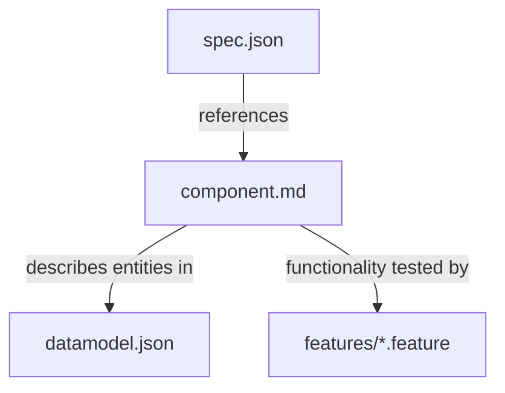

# Specky Specification

This repository contains the technical specification for Specky, a tool for creating, sharing, and downloading component specifications for application development.

[Overview of Specky](docs/specky-overview.md)

## What is Specky?

Specky is a tool that enables developers to share component specifications, similar to how they share libraries. The Specky-Package-Manager (spm) is a command-line tool that allows developers to work with third-party specifications as if they were project dependencies.

## Specification Overview

At the core of Specky are **component specifications**. These specifications contain **only functional requirements**, deliberately separated from implementation details like programming languages, frameworks, or deployment environments. This separation maximizes the usefulness of requirements so they can be applied across various contexts.

## Specification Structure

A complete Specky component specification consists of the following files:

```
component-name/
├── spec.json           # Component metadata (required)
├── component.md        # Detailed component description (required)
├── datamodel.json      # Data entity definitions (optional)
└── features/           # Gherkin feature specifications (optional)
    ├── feature1.feature
    └── feature2.feature
```

## Core Specification Files

### spec.json

The `spec.json` file is the heart of every Specky component specification. It contains:

[Detailed spec.json specification](docs/specky-spec-json.md)

- **Metadata**: Name, version, description, author information
- **Dependencies**: References to other component specifications
- **Configuration**: Component-specific settings
- **Publishing information**: Registry and distribution settings

This file serves as the package manifest and defines how Specky should handle the component.

### component.md

The `component.md` file contains the actual functional requirements and detailed description of the component. Written in Markdown, it:

[Detailed component.md specification](docs/specky-component-md.md)

- Describes what the component should do
- Defines functional requirements in a language-agnostic way
- Provides enough detail for implementation
- Is structured for both human and LLM (Large Language Model) understanding

### datamodel.json (Optional)

The `datamodel.json` file defines the data entities and their attributes that the component works with. It:

[Detailed datamodel.json specification](docs/specky-datamodel-json.md)

- Specifies entities, attributes, and relationships
- Provides a clear data model for implementation
- Enables validation and consistency checks

### features/ Directory (Optional)

The `features/` directory contains Gherkin feature specifications that define tests for the component:

[Detailed features/ directory specification](docs/specky-features-directory.md)

- Uses Gherkin v6 syntax for human-readable behavior descriptions
- Defines expected behavior through concrete examples
- Provides test scenarios for implementation
- Facilitates behavior-driven development (BDD)

## Relationships Between Files

The files in a Specky component specification are interrelated:

- `spec.json` provides the metadata and identifies the component
- `component.md` describes the functional requirements referenced in `spec.json`
- `datamodel.json` defines the data structures mentioned in `component.md`
- Files in the `features/` directory provide test scenarios for the functionality described in `component.md`



Together, these files provide a comprehensive specification of a component that can be implemented in any programming language or framework while ensuring it meets the functional requirements.

## Contributing

For information on contributing to the Specky specification, please see the documentation repository or contact the Specky team.

## Command Line Interface

For information about the Specky Package Manager (spm) command line interface, see the [man page](docs/specky-man-page.md).